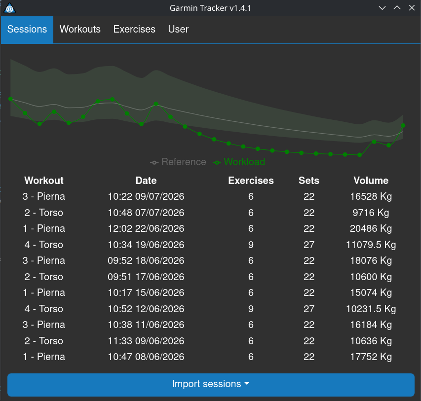
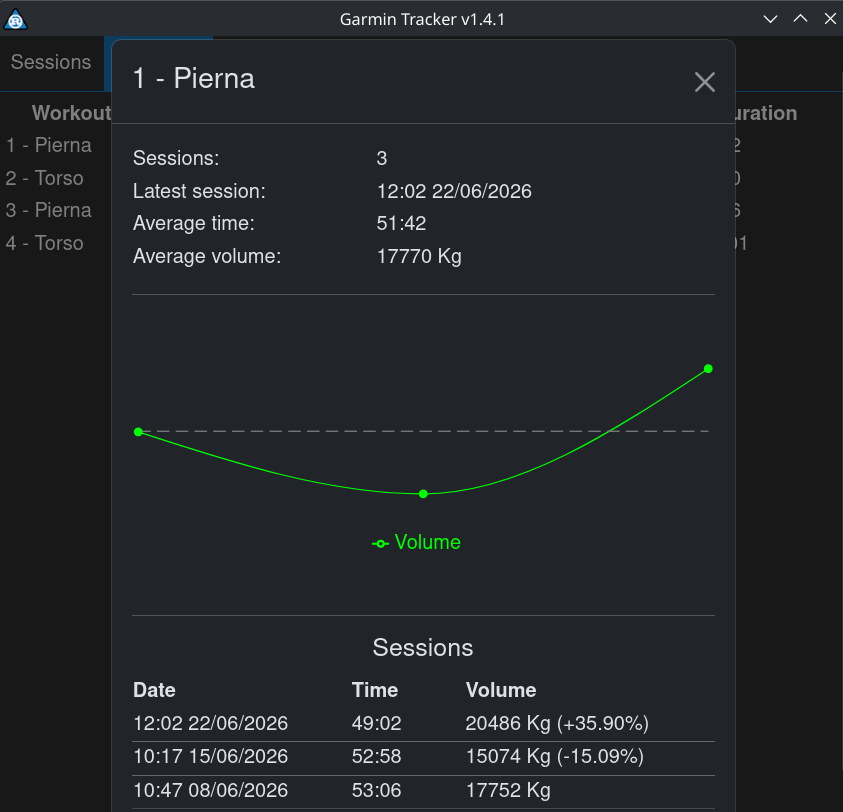
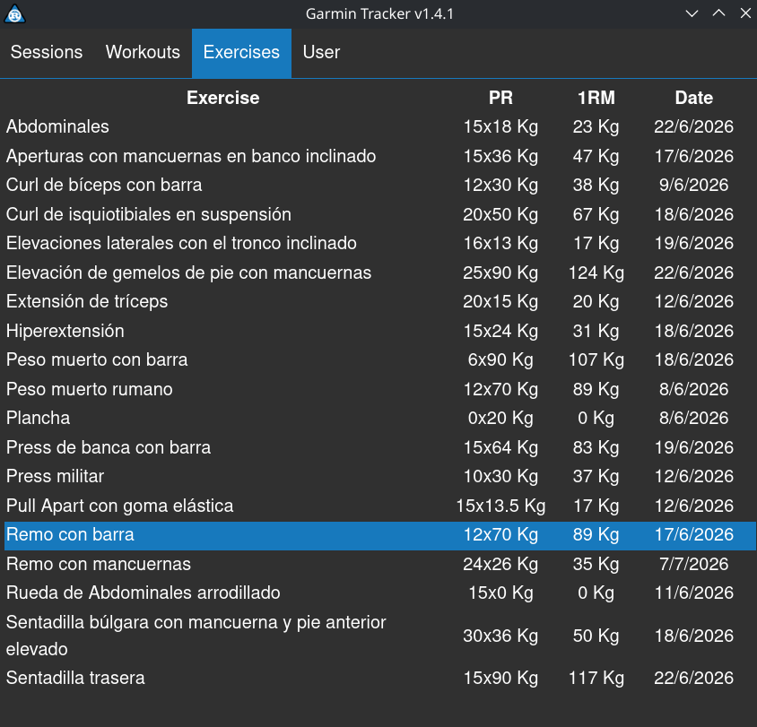
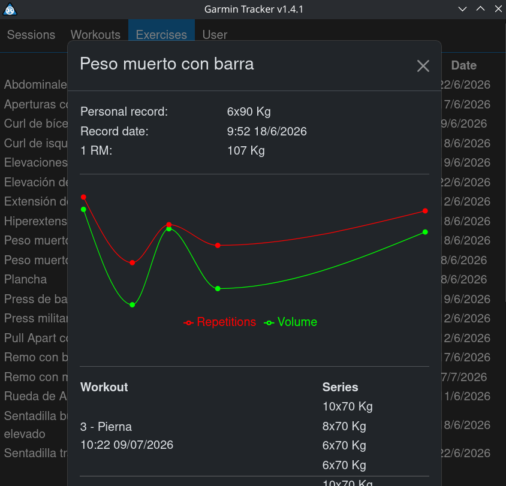
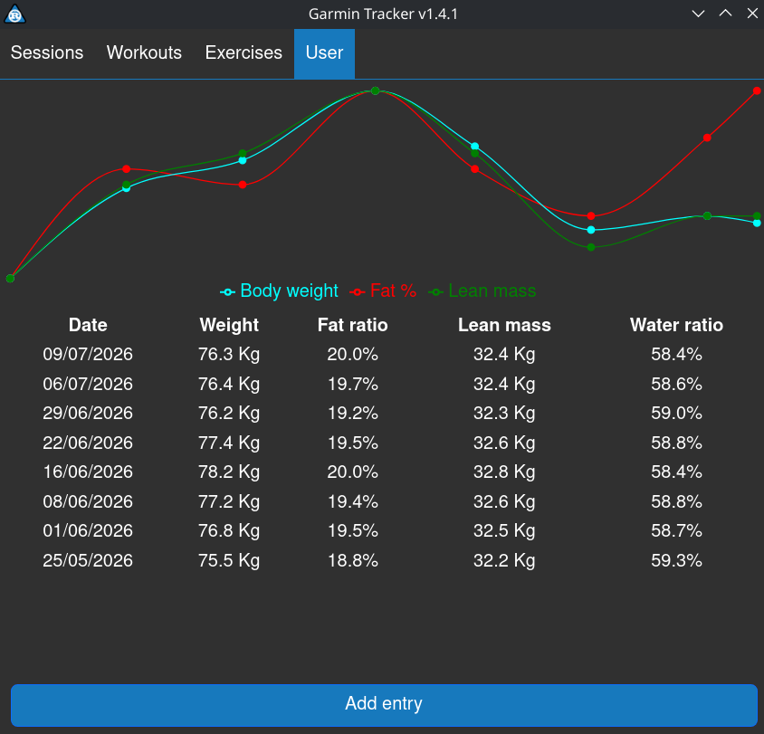

# Garmin Tracker

[](https://deepwiki.com/Emiliopg91/garmin-tracker-rs)

**Sync your Garmin devices and track your strength training — all in one desktop app.**

Garmin Tracker is a cross-platform desktop application built with [Tauri](https://tauri.app/), combining a Rust backend with a React + TypeScript frontend. It connects to Garmin watches over USB (MTP), imports your activity `.FIT` files, and stores your sessions, exercises, and body measurements in a local SQLite database — no cloud account required.

## Screenshots

|  |  |
| :----------------------------------------------------: | :----------------------------------------------------: |
|  |  |
|  |

## Features

- **Device sync over USB (MTP)** — Detects connected Garmin devices and downloads new activities directly from the watch's storage.
- **Manual import** — Import activity files from disk if you prefer not to connect a device.
- **`.FIT` file parsing** — Parses Garmin `.FIT` activity files into structured session and series data.
- **Strength training tracking** — Review/edit recorded sessions and their series (sets, reps, weight, etc.).
- **Body measurements** — Log and track user body measures over time.
- **Local database** — All data is persisted in a local SQLite database (schema managed via versioned DDL migrations).
- **Desktop notifications** — Native notifications for background events (e.g. device sync completed).
- **Single instance** — Prevents multiple copies of the app from running at once, avoiding database corruption.

## Tech stack

| Layer     | Technology                                   |
| --------- | -------------------------------------------- |
| Shell     | [Tauri 2](https://tauri.app/)                |
| Backend   | Rust                                         |
| Frontend  | React 19 + TypeScript, Vite, React Bootstrap |
| Database  | SQLite                                       |
| Packaging | Arch Linux `PKGBUILD`                        |

## Installation

### Arch Linux (via `AUR helper`/`PKGBUILD`)

Install the AUR `garmin-tracker-rs` package to get latest stable version of the application and every external dependency.

### From source

Requirements: [Rust](https://www.rust-lang.org/tools/install), [pnpm](https://pnpm.io/), and the [Tauri prerequisites](https://tauri.app/start/prerequisites/) for your platform.

```bash
git clone https://github.com/Emiliopg91/garmin-tracker-rs.git
cd garmin-tracker-rs
pnpm install
make build       # or: pnpm tauri build
```

## Development

```bash
pnpm install
make run          # runs the app in dev mode
```

Other useful commands (see the `Makefile`):

| Command        | Description                                             |
| -------------- | ------------------------------------------------------- |
| `make run`     | Start the app in development mode                       |
| `make build`   | Build a release bundle                                  |
| `make lint`    | Lint frontend (ESLint) and backend (`cargo clippy`)     |
| `make clean`   | Remove `node_modules`, `dist`, and Rust build artifacts |
| `make update`  | Update project dependencies                             |
| `make release` | Cut a new release                                       |
| `make publish` | Publish a release                                       |

## Project structure

```
resources/
  ddl/                    Versioned SQL schema migrations
  scripts/                Python helper scripts (release/versioning/dependency management)
  PKGBUILD, *.rules       Linux packaging assets
src/                    React + TypeScript frontend
src-tauri/               Rust backend (Tauri application)
  src/garmin/
    database/            SQLite access layer (DAOs for devices, exercises, series, sessions, users)
    mtp/                  Garmin device discovery & activity download over MTP/USB
    parser/               .FIT file parsing
  src/ui/                 Tauri commands exposed to the frontend (app, devices, exercises,
                          notifications, sessions, user, workouts)
```

## License

Distributed under the GPL-2.0 license, as declared in the project's `PKGBUILD`.
