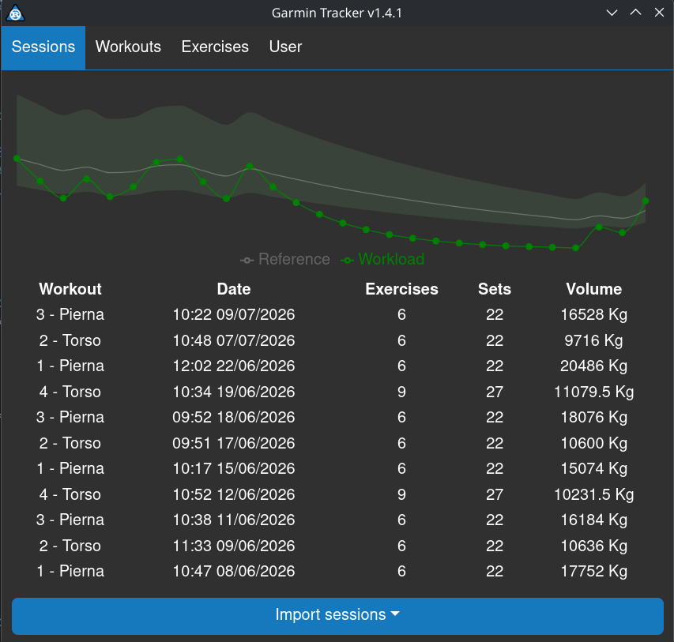
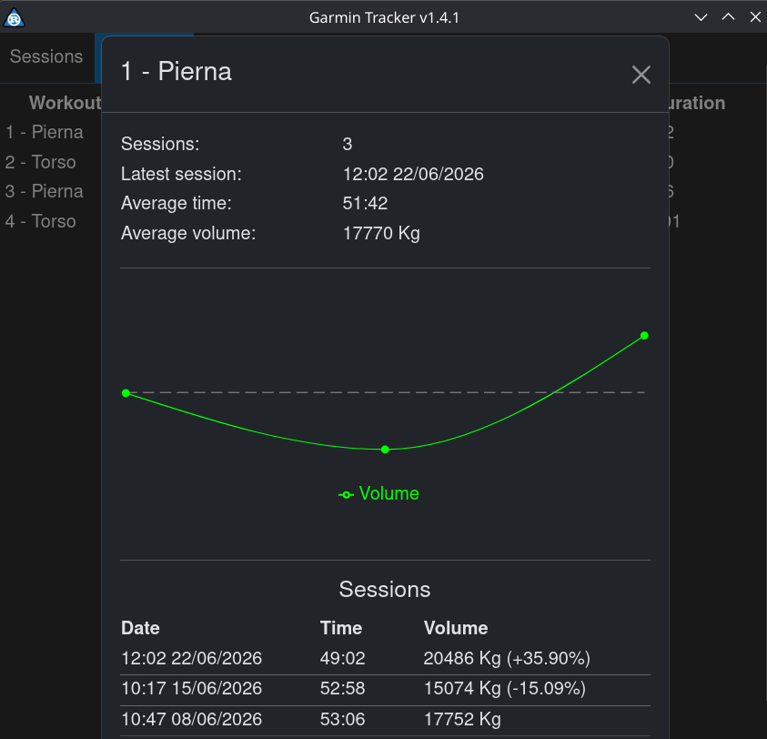
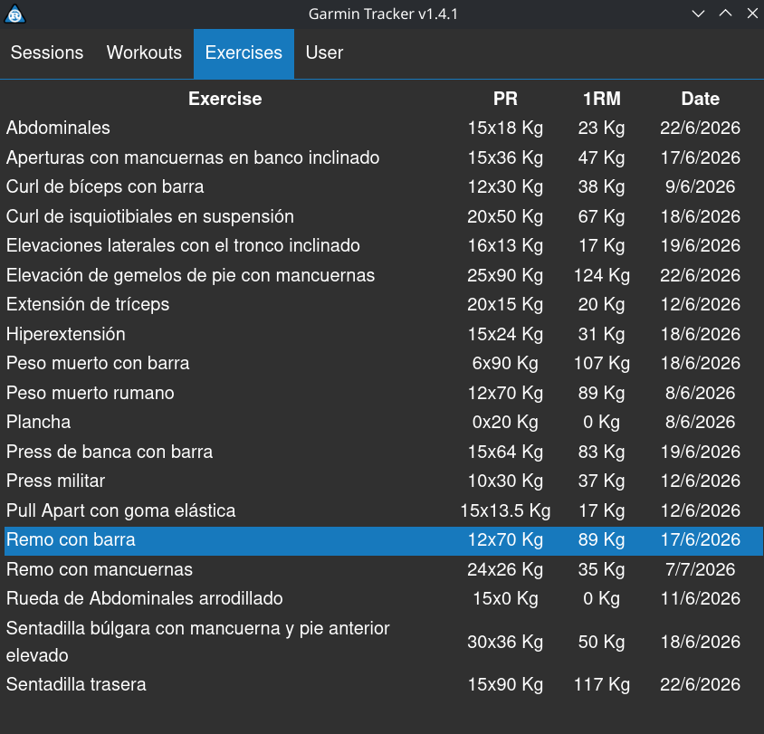
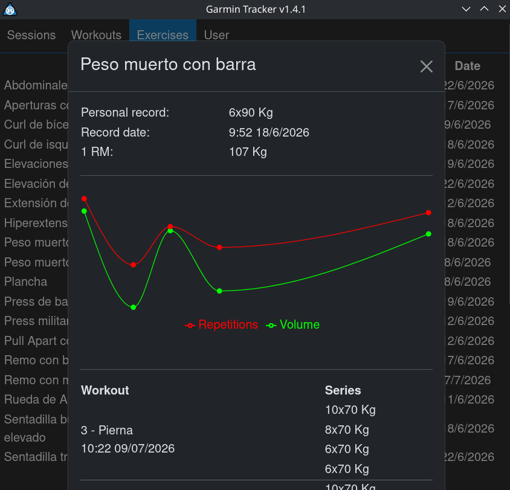
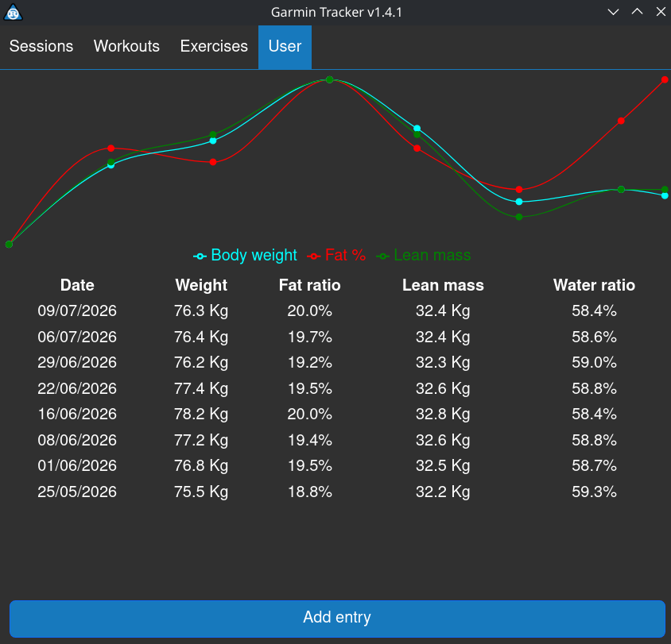

# Garmin Tracker

[](https://deepwiki.com/Emiliopg91/garmin-tracker-rs)

**Sync your Garmin devices and track your strength training — all in one desktop app.**

Garmin Tracker is a cross-platform desktop application built with [Tauri](https://tauri.app/), combining a Rust backend with a React + TypeScript frontend. It connects to Garmin watches over USB (MTP), imports your activity `.FIT` files, and stores your sessions, exercises, and body measurements in a local SQLite database — no cloud account required.

## Screenshots

|  |  |
| :----------------------------------------------------: | :----------------------------------------------------: |
|  |  |
|  |

## Features

- **Device sync over USB (MTP)** — Detects connected Garmin devices and downloads new activities directly from the watch's storage, with parallelized parsing and optimized transfers for faster syncs. Auto-sync on connect can be toggled off in favor of manual imports.
- **Manual import** — Import activity files from disk if you prefer not to connect a device.
- **`.FIT` file parsing** — Parses Garmin `.FIT` activity files into structured session, series, heart rate, and GPS data.
- **Strength training tracking** — Review/edit recorded sessions and their series (sets, reps, weight, etc.).
- **GPS route tracking** — Displays the recorded route on an interactive map (start/end markers, route line) for outdoor activities. Unnamed GPS sessions are automatically labeled with the start location, resolved via reverse geocoding.
- **Heart-rate zones** — Visualizes heart rate over a session as a color-coded chart and breaks down time spent in each HR zone.
- **Body measurements** — Log, review, and delete body measures over time.
- **Configurable app settings** — Choose weight/distance units, toggle launch on system boot, and enable/disable automatic sync on device connect.
- **Local database** — All data is persisted in a local SQLite database (schema managed via versioned DDL migrations, applied automatically at startup).
- **Desktop notifications** — Native, localized (English/Spanish) notifications for background events (e.g. device connected/disconnected, sync completed, update available).
- **Single instance** — Prevents multiple copies of the app from running at once, avoiding database corruption.
- **Rotating file logs** — Structured, leveled logging to disk with automatic rotation.

## Tech stack

| Layer                | Technology                                                                                                 |
| -------------------- | ---------------------------------------------------------------------------------------------------------- |
| Shell                | [Tauri 2](https://tauri.app/)                                                                              |
| Backend              | Rust (2024 edition)                                                                                        |
| Frontend             | React 19 + TypeScript, Vite, MUI, Recharts, React Leaflet                                                  |
| Database             | SQLite, via [`rusqlite_orm`](https://crates.io/crates/rusqlite_orm) (custom ORM crate)                     |
| Backend <-> frontend | Typed IPC — TypeScript client/models auto-generated from the Rust `dto`/`logic` code via `tauri-rs-ts-ipc` |
| Codegen              | In-repo proc-macro crate `garmin-tracker-rs-macros` — command call tracing/logging, compile-time i18n      |
| Packaging            | Arch Linux `PKGBUILD`                                                                                      |

## Installation

### Arch Linux (via `AUR helper`/`PKGBUILD`)

Install the AUR `garmin-tracker-rs` package to get latest stable version of the application and every external dependency.

### From source

Requirements: [Rust](https://www.rust-lang.org/tools/install), [pnpm](https://pnpm.io/), and the [Tauri prerequisites](https://tauri.app/start/prerequisites/) for your platform.

```bash
git clone https://github.com/Emiliopg91/garmin-tracker-rs.git
cd garmin-tracker-rs
pnpm install
make build       # or: pnpm tauri build
```

## Development

```bash
pnpm install
make run          # runs the app in dev mode
```

Development builds use [`mold`](https://github.com/rui314/mold) as the linker and [`sccache`](https://github.com/mozilla/sccache) for compilation caching to speed up iteration; install both for the best experience (or adjust the `Makefile` if you don't have them).

Other useful commands (see the `Makefile`):

| Command                | Description                                                                                             |
| ---------------------- | ------------------------------------------------------------------------------------------------------- |
| `make run`             | Start the app in development mode                                                                       |
| `make build`           | Build a release bundle                                                                                  |
| `make lint`            | Lint frontend (ESLint + `tsc`) and backend (`cargo clippy` for both `src-tauri` and `src-tauri-macros`) |
| `make clean`           | Remove `node_modules`, `dist`, and Rust build artifacts                                                 |
| `make setup-toolchain` | Install build dependencies declared in `PKGBUILD` via `paru`                                            |
| `make update`          | Update project dependencies                                                                             |
| `make release`         | Cut a new release                                                                                       |
| `make publish`         | Publish a release                                                                                       |

## Project structure

```
resources/
  ddl/                    Versioned SQL schema migrations, embedded at build time
  translations.yaml       Source strings for localized notifications (en/es)
  scripts/                Python helper scripts (release/versioning/dependency management)
  PKGBUILD, *.rules       Linux packaging assets
src/                      React + TypeScript frontend
  components/             UI screens (App, BodyMetrics, Exercises, Sessions, Settings, Workouts, NavBar, Loading)
  context/                React context/providers
  utils/backend/          Auto-generated Tauri IPC client and models (do not edit manually)
src-tauri/                Rust backend (Tauri application)
  src/dao/                SQLite access layer (body metrics, devices, exercises, GPS coordinates,
                           heart rate, series, sessions, settings)
  src/dto/                Data transfer objects shared with the frontend (via generated TS types)
  src/logic/               Business logic backing the Tauri commands (app, body metrics, devices,
                           exercises, notifications, sessions, workouts)
  src/mtp/                Garmin device discovery & activity download over MTP/USB
  src/parser/              .FIT file parsing
  src/utils/               Shared constants and date/time helpers
src-tauri-macros/         Proc-macro crate: command tracing/logging and compile-time translations
```

## License

Distributed under the GPL-2.0 license, as declared in the project's `PKGBUILD`.
