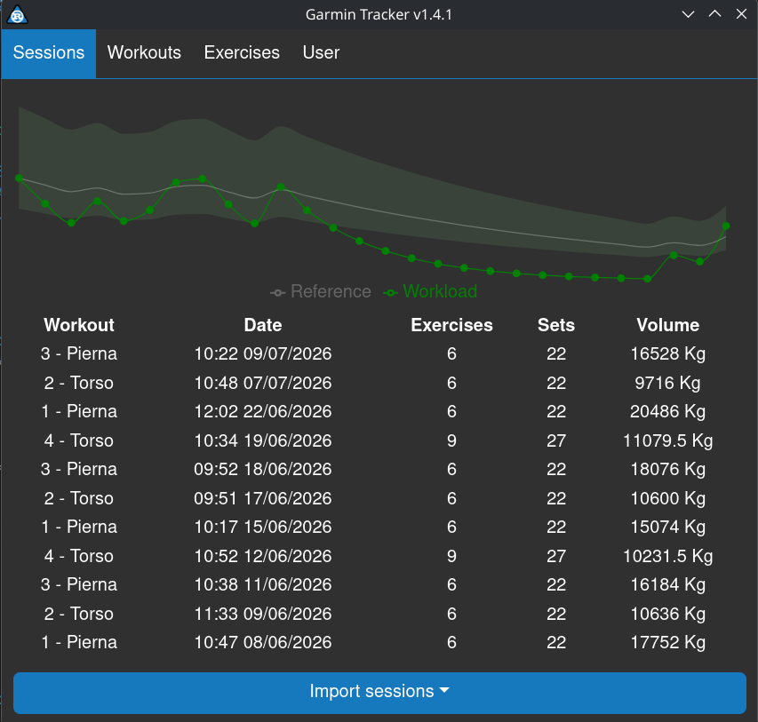
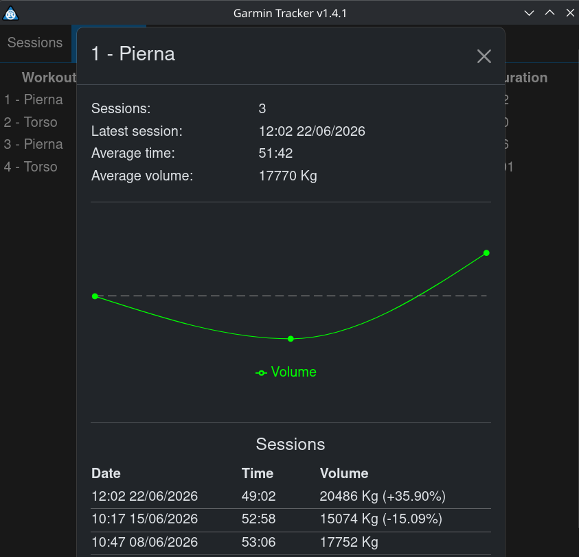
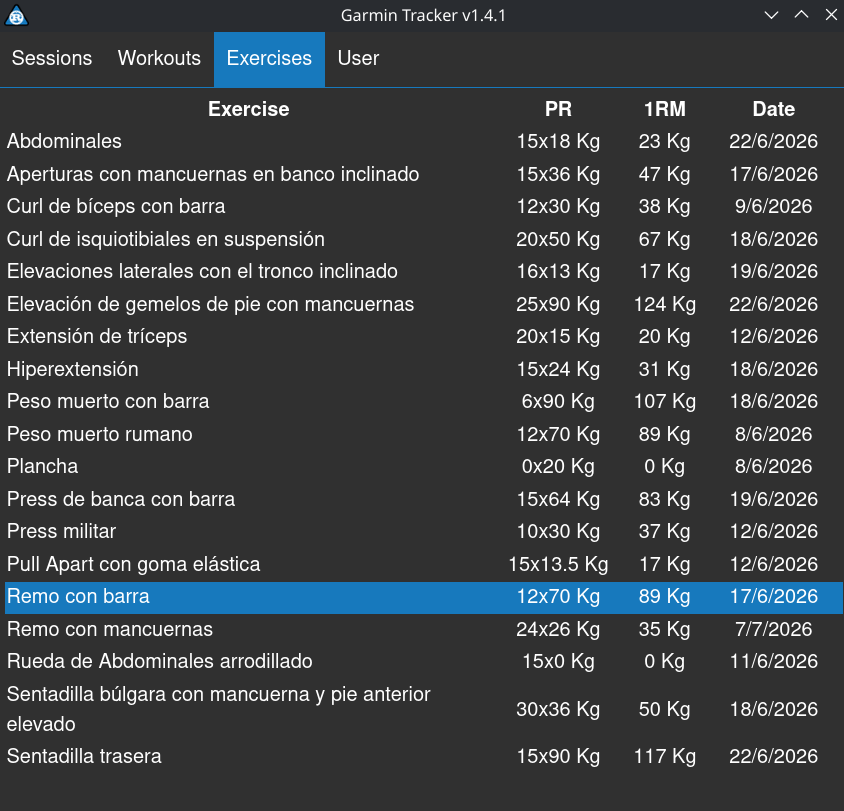
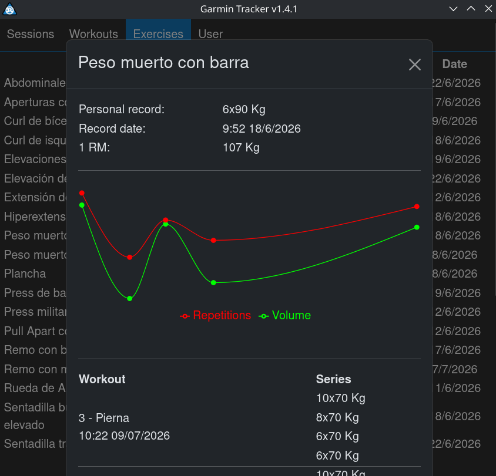
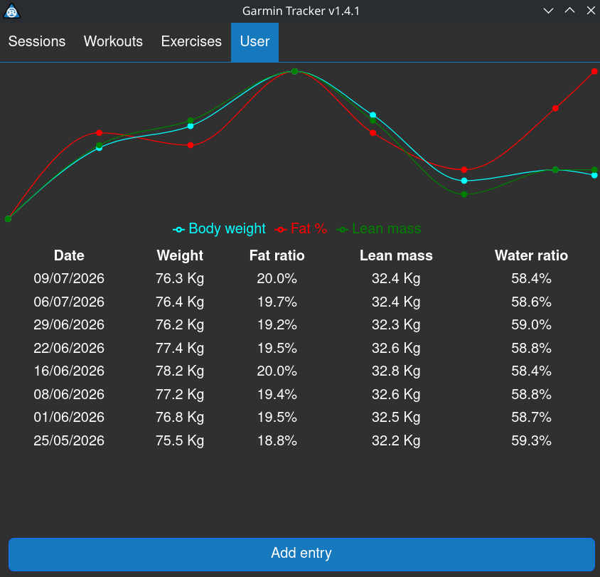

# Garmin Tracker

[](https://deepwiki.com/Emiliopg91/garmin-tracker-rs)

**Sync your Garmin devices and track your activities — all in one desktop app.**

Garmin Tracker is a Linux desktop application built with [Tauri](https://tauri.app/), combining a Rust backend with a React + TypeScript frontend. It connects to Garmin watches over USB (MTP), imports your activity `.FIT` files, and stores your sessions, exercises, and body measurements in a local SQLite database — no cloud account required.

## Screenshots

|  |  |
| :----------------------------------------------------: | :----------------------------------------------------: |
|  |  |
|  |

## Features

- **Device sync over USB (MTP)** — Auto-detects Garmin devices and downloads new activities.
- **Manual `.FIT` import** — Import activity files from disk.
- **Launch on device connect** — Starts the app automatically when a device is plugged in.
- **`.FIT` parsing** — Sessions, series, heart rate, GPS, speed, and laps.
- **Activities and training tracking** — Review/edit sessions, notes and sets, with 1RM estimation.
- **Strength session comparison** — Compare sessions and their exercises side by side.
- **Workouts** — Create and edit strength workouts, upload them to the device, and import their steps from it.
- **Workout upload queue** — Workouts sent while a device is disconnected are queued and pushed automatically on its next connection.
- **Training load heatmap** — Daily load overview with records on the home page.
- **GPS route tracking with laps** — Interactive map, speed-colored track, satellite/street toggle, reverse-geocoded naming, GPX export with elevation.
- **Heart-rate zones** — Color-coded HR chart and time-in-zone breakdown.
- **Personal record notifications** — Desktop alert on a new strength PR.
- **Body measurements** — Log, review, delete, and compare over time, with 7-day average charts.
- **Database export to JSON** — Full database export for backup or analysis.
- **Cloud backup** — One-click backup upload to OneDrive or Dropbox via `rclone`.
- **Update check** — Notifies you when a new release is available.
- **System tray icon** — Open or quit from the tray, optionally start minimized and keep running in the background when the window is closed.
- **Configurable settings** — Language, units, launch on boot, auto-sync, tray behavior — applied live.
- **Local database** — SQLite with versioned, auto-applied migrations.
- **Desktop notifications** — Native, localized alerts for background events.
- **Single instance** — Prevents multiple app copies from corrupting the database.
- **Rotating file logs** — Leveled logging with automatic rotation.

## Installation

### Arch Linux (via `AUR helper`/`PKGBUILD`)

Install the AUR `garmin-tracker-rs` package to get latest stable version of the application and every external dependency.

### From source

Requirements: [Rust](https://www.rust-lang.org/tools/install), [pnpm](https://pnpm.io/), and the [Tauri prerequisites](https://tauri.app/start/prerequisites/) for your platform.

```bash
git clone https://github.com/Emiliopg91/garmin-tracker-rs.git
cd garmin-tracker-rs
pnpm install
make build       # or: pnpm tauri build
```

## Development

```bash
pnpm install
make run          # runs the app in dev mode
```

Development builds use [`mold`](https://github.com/rui314/mold) as the linker and [`sccache`](https://github.com/mozilla/sccache) for compilation caching to speed up iteration; install both for the best experience (or adjust the `Makefile` if you don't have them).

## License

Distributed under the GPL-2.0 license, as declared in the project's `PKGBUILD`.
